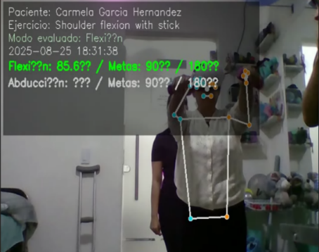
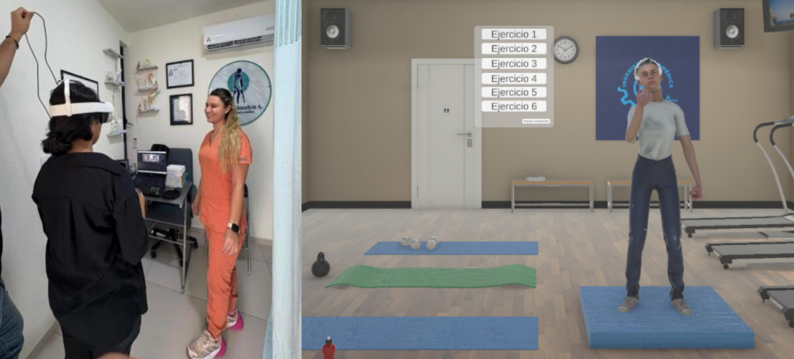
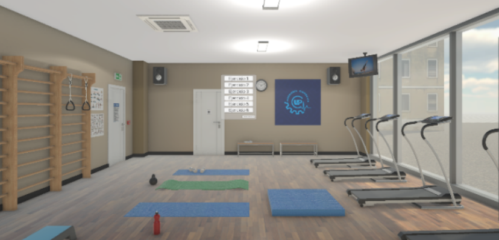

# Sistema de Rehabilitación con Realidad Virtual y Análisis Biomecánico en Tiempo Real

Este estudio presenta un sistema innovador que combina Realidad Virtual (VR) inmersiva con análisis biomecánico cuantitativo para mejorar la rehabilitación de lesiones comunes en el hombro, como la tendinitis del manguito rotador.

El sistema utiliza un visor **Meta Quest VR** para sumergir a los pacientes en escenarios terapéuticos tipo videojuego, junto con un algoritmo de visión por computadora en **Python** (usando MediaPipe y OpenCV) que analiza grabaciones de video para calcular el **Rango de Movimiento (ROM)** del hombro (Flexión y Abducción).

## 🌟 Características Principales

* **Terapia Inmersiva:** Utiliza un visor **Meta Quest VR** para sumergir a los pacientes en escenarios terapéuticos tipo videojuego.
* **Análisis Biomecánico:** Un algoritmo de visión por computadora en **Python** (usando MediaPipe y OpenCV) analiza grabaciones de video para calcular el **Rango de Movimiento (ROM)** del hombro (Flexión y Abducción).
* **Alta Motivación:** Los pacientes en el estudio piloto reportaron mayor motivación y compromiso en comparación con la fisioterapia tradicional.
* **Gestión de Pacientes:** Incluye una base de datos SQLite para el registro y seguimiento de pacientes.
* **Reportes en PDF:** Genera reportes automáticos de la sesión de terapia.

## 🛠️ Instalación y Uso

Para ejecutar este proyecto localmente, sigue estos pasos:

1.  **Clona el repositorio:**
    ```bash
    git clone [https://github.com/TU_USUARIO/VR-Rehabilitacion-Hombro.git](https://github.com/TU_USUARIO/VR-Rehabilitacion-Hombro.git)
    cd VR-Rehabilitacion-Hombro
    ```

2.  **(Recomendado) Crea un entorno virtual:**
    ```bash
    python -m venv venv
    source venv/bin/activate  # En Windows usa: venv\Scripts\activate
    ```

3.  **Instala las dependencias:**
    ```bash
    pip install -r requirements.txt
    ```

4.  **Ejecuta la aplicación:**
    ```bash
    python src/main.py
    ```

## 📄 Publicación

Este trabajo fue aceptado recientemente (Noviembre 2025) para su publicación por **Academia Journals** en el congreso de Medellín.

Para más detalles sobre la metodología y los resultados del estudio piloto, por favor consulta nuestro artículo:

* **[Consulta el artículo aquí](./paper/MED287.docx)**

## 🖥️ Vistas del Sistema

<p align="center">
  
  <br>
  <em>Pantalla de análisis biomecánico</em>
</p>
<p align="center">
  
  <br>
  <em>Pantalla de registro de paciente</em>
</p>
<p align="center">
  
  <br>
  <em>Pantalla de menú principal</em>
</p>

## 📺 Video de Demostración

Puedes encontrar una explicación completa y una demostración del proyecto en YouTube:

* **[Ver Video] "Sistema de Rehabilitación con Realidad Virtual y Análisis Biomecánico"** (https://www.youtube.com/watch?v=Yelu0DRGfQA&list=PLu3midZfylxQiEslfACPGaZhUpGpTXyyl)
